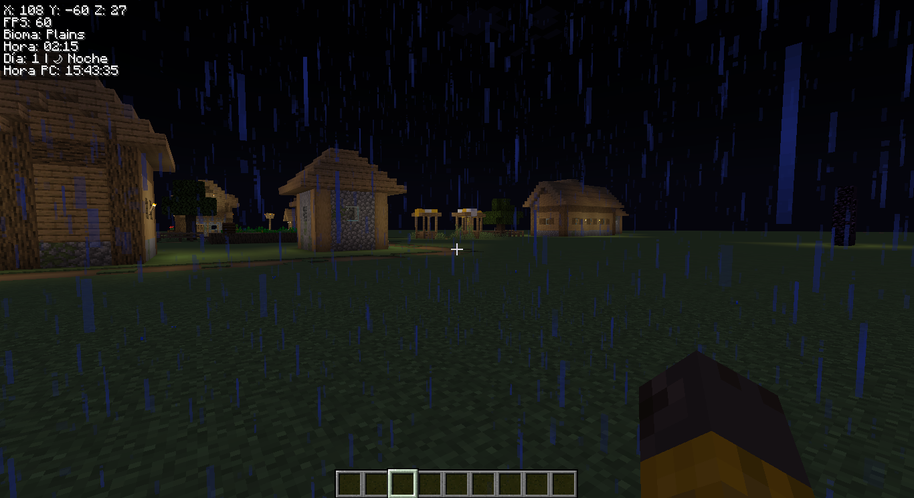
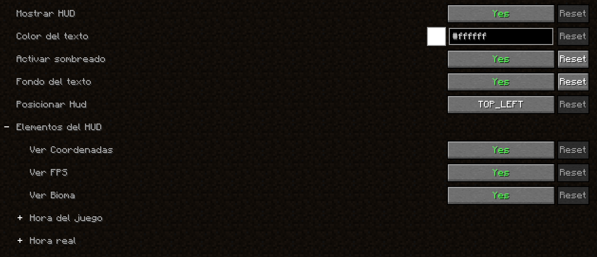
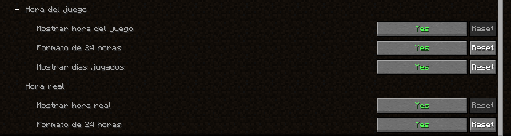

<h1 align="center">
   
    
   
  Simple Hud
   
</h1>

  
  

## Hud Personalizable

* Configuración del Hud
    - Cambiar Color
    - Activar / Desactivar sombreado
    - Posicionar Hud (Top Left | Top Rigth | Bottom Left | Bottom Rigth)
    - Activar / Desactivar background
* Ver Coordenadas.
* Ver FPS
* Ver Biomas
* Ver Hora del mundo
* Ver cuantos Días tiene el mundo
* Ver Hora local

# Imágenes

